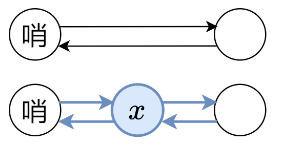
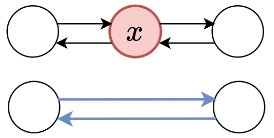

1. Typical used loop

   ```java
   while(cur != null || cur.next != null) {	// Do sth.}
   ```

   Because `null` don't have the `.next`, it would occurs error;
   
2. **Reverse**

   + Don't need to **change the .next**, try to **change the value!**;

   ```java
   ListNode cur = head, prev = null;
   while(cur != null) {
     ListNode nextNode = cur.next;
     cur.next = prev;
     prev = cur;
     cur = nextNode;
   }
   return prev;	// 注意嗷！
   ```
   
3. Reverse **[M, N]** 处的节点！！！
   

- 最后返回 **Dummy.next**即可；

4. Reverse (**N个N个节点来**)
   

- 注意，**P0的位置！！ 下一个P0 是，没有发生更改的 P0.next!!!!**
- 其它的就是基于上一个做法的了

5. LRU 做法 （**双向链表**）

   - **插入**
     

     ```java
     ListNode newNode;	// 假设已经初始化
     newNode.pre = leftNode;
     newNode.next = rightNode;
     
     leftNode.next.pre = newNode;
     leftNode.next = newNode;
     ```

   - **删除**
     

     ```java
     // 假设 removeNode 已经连接好了
     removeNode.prev.next = removeNode.next;
     removeNode.next.prev = removeNode.prev;
     ```

   - 