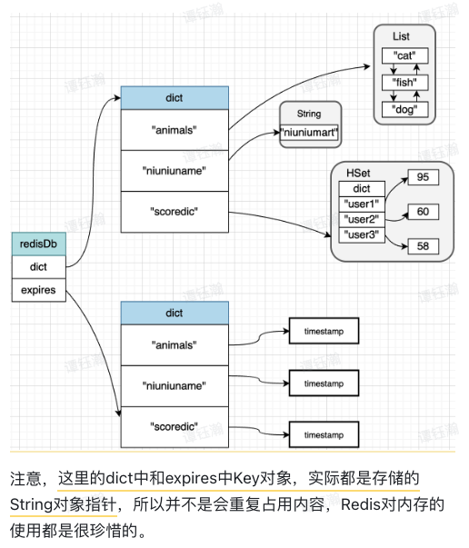
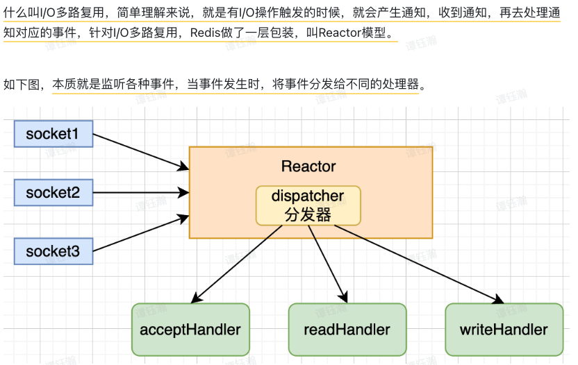

## 1. Redis在内存的存储

redis的数据库，有**各种Dictionary**;

1. **Data** Dictionary
   
   - key 一般都是字符串对象，value 可以是Redis允许的对象 (即Redis的数据结构)；
2. **Expires** Dictionary
   用于设置，每个Data的**过期时间**，根据他们的**key**来设置。
   
   - Redis对内存的使用很珍惜的，因为key是String的**指针**。E.g. dict中的animals，实则是存储 **指向animals的指针**;
   - **Timestamp**：存的是，过期的时候 对应的时间点  (xx小时xx分钟xx秒 类似的)，而不是那种 During (xxx分钟，xxx秒)；
   - `SET animals cat ex 60`;
3. 其实核心就是 **字典存储 (key-value)**；

## 2. Redis 是单线程or多线程？（重点）

1. Redis‘s Core Processing Logic：***Always Single-Threaded***
   + Redis 使用 **single main thread** 来处理client的请求；
   + *Socket Read* --> *Parse Command* --> *Execute Command* --> *Socket Write*; (socket读，转化命令，执行，socket写)；

​	但是，**I/O** part 是**多线程** (Redis 6.0之后，但默认是不开启的，需要从 redis.conf 文件中改)
​	多线程**不只是** I/O变了，需要注意；

2. 为什么选择单线程？

   1. **Redis执行快** (使用*内存*，*k-v存储*)：因为性能瓶颈通常不在Redis，而是在 网络，I/O 等；
   2. **引入多线程的成本高**：
      - 数据结构需要重新改造（之前是为了单线程优化的），要改成 **Thread Safety**;
      - 多线程需要保证 事务的执行是**ACID**的：(*Atomcity* 没法一部分执行成功一部分失败。  *Isolation* 事务执行的结果，在没提交前，其他事务是**看不到**的)
   3. 线程，会占用宝贵的内存；

3. **I/O Multiplexing** (I/O 多路复用)

   由于发展，Volume of Transactions 非常高，此时 **I/O 就会是性能瓶颈**；使用 多路复用，即可以提升 I/O的性能；
   

   + 这会提升 Redis单线程的 **Concurrency** (同一时间段内，可以执行更多任务) (*Parallel* 是指，一个时间点，有多个任务在同时执行；)

## 3. 内存满了怎么办

1. Redis，对于**32位**系统，最大支持3G，因为 32位系统最大支持 4G内存（2^32 / 8 / 1024 / 1024 = 4GB）
2. 当内存满了，进行 **内存淘汰**，主要有两种：
   + Noeviction (不淘汰): 写入将会失败，但已有数据不淘汰 (数据很重要才用)；
   + **LRU** (最长时间没使用的)、**LFU** (最少用过的)、random、TTL(time to live) ... ...
3. 当满了的时候，每次进行 **读写操作**，都会触发；

**回收策略**

1. **LRU** (*Least Recently Used*)
   - 即用一个列表，记录每个key被使用的时间，但这个开销对于Redis太贵了；
   - Redis 2.8 **随机采样**，并执行LRU；当内存不足的时候，就执行这个算法；
     - Allkeys：全部keys中随机采样
     - Volatile：有Expire Time的keys中随机采样
   - Redis 3.0 **淘汰池优化** (Eviction Pool)：维护一个fixed-size的Candidate Pool。

2. **LFU** (*Least Frequently Used*)
   - 因为有些数据可能用的非常多，但有几次没用，这样删掉不可行；
   - Redis 4.0 引入了这个，并将该属性，设为 Redis Object 的成员属性 (一个24Bit的)；这个24-bit，只可以记录 LRU & LFU 的某一种；
   - 前16bit，记录**上次使用的TimeStamp**，后8bit：**访问的热度** (久了不访问，热度会下降)。二者一同来决定LFU；

