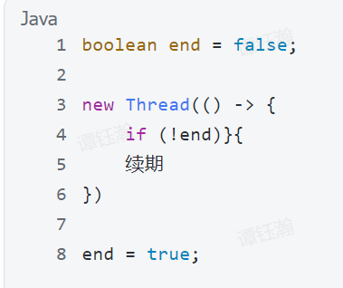

## 1. 定时缓存的实现

1. 我使用什么方式
   **Spring Scheduler**，在主类 (main class 开启 *@EnableScheduling*，指定频率即可，使用了 **CRON** Expression) 不记得了我是直接在网页上生成的；
2. 还有什么实现的方式？
   我记得还有一些 independent framework **Quartz**，以及一些 Task Distribution Platform；

## 2. 控制定时任务的执行

1. 如果不控制，会怎样？
   - 想象我们有500台服务器，它们在同一时间执行了定时任务 (比如插入数据到数据库)，就会 **Resource Overuse**，然后有 **Dirty Data** (脏数据，因为有 *Duplicate Insertion*)；
2. **！几种控制方式！**
   1. 分离 定时任务和主程序，用一个**Dedicated**服务器**运行Scheduled Task**，但是任务少的时候，成本太大，也有 **Single Point of Failure**；
   2. 在**配置**文件中，**Hard-Coded** IP地址，Only the Servers that **Match** 可以执行定时任务。**成本低且简单**，可是我们的IP**可能是动态的** (DHCP可能会给每个设备，分配一个**新的IP地址**，或者Expiration Time到了，DHCP也会重新给一个IP地址)
      (变了IP，就需要 **Re-Deployment**)
   3. **Dynamic Configuration**：我的理解是，将配置文件，存在 *Database, Redis* 或者专门存放配置的地方 (Nacos？)。就不需要 重新部署了，但是还是需要 **人工更改**； 

## 3. 解决方法：分布式锁！

1. Java的锁有什么问题？
   Java的锁一般使用 **Synchronized**，但只能对**单个JVM有效**，(其它服务器，你无法控制);
2. 为什么我要用分布式锁？
   因为我希望，同一时间，只有**一个服务器**，读取配置文件，并执行任务到完成为止；
3. 几种分布式锁的选择
   - MySQL 的**Row-Level Locking** (行级锁) `SELECT ... FOR UPDATE`;
   - Redis实现：**推荐这个，速度快，支持LUA Script**;
4. 原理，见redis，分布式锁；

## 4. Redisson 实现的分布式锁

Redisson是一个Java的Framework，可以让开发者，像**使用Collection Type**一样，来使用**Redis**; (比如，里面有个类 RList，它就是基于 List接口的实现)

### **！！！实现步骤！！！**

1. 创建一个lock object，
   `RLock lock = redissonclient.getLock("yupao:precachejob:docache:lock");`
2. 使用 **try-catch-finally** block
3. `try` 中，**尝试获取锁**；
   `if (lock.tryLock()) {do sth.;}`
4. `finally` 中，**释放 自己的锁**
   `finally` 是 在 `try-catch` 执行完毕后，**再执行的block**，用于释放 **自己的锁！** (即属于，**本线程**)
   `if (lock.isHeldByCurrentThread()) {lock.unlock();}`

1、Redis，一定要加**过期时间**！但是如果 **未执行完呢？**

**Extension! (续期)**

Redisson 有 **watch-dog** mechanism；可以理解为，在**没有收到任务完成信号前**，自动 **Extend** the Expiration Time (可以引入一个 finished变量)

