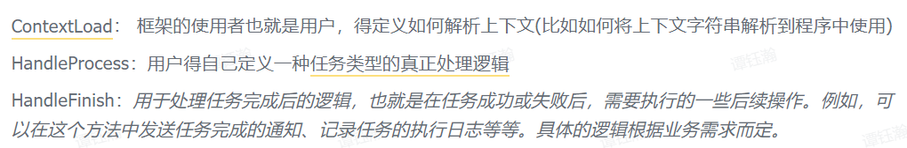

### 1. 怎么接入

1. 安装好依赖的组件(Components)
   - **MySQL** 我们的框架还依赖 2 Tables (Task Location and Task Configuration), 我们应该先在MySQL创建好；
   - 对于 Task Message，我这里认为是，一种任务类型，一张表，所以用户需要自己考虑创多少个

2. 启动 **flowsvr**，然后使用Web接口，比如Postman，测试任务是否被插入MySQL里；

   - 用户需要引入 jar package，实现三个interface

     

3. 启动worker

### 2. How to deploy

1. 实际应用时，我们可以使用 Multi-Machine Deployment；启动 **多个 Aaron & Flowsvr**；
2. 因为 Flowsvr 通过Web Interface调用，我们还可以使用一个 NginX 来做 Load-Balance

### 3. 为什么存储不用Redis，而用MySQL

- MySQL 的 **Persistency** is more reliable than Redis, though it can also achieve persistency.
- MySQL support **Relational-based** Query. (我们经常会 Pull A **batch** of Tasks according to **Stage**)

### 4. 上下文信息如何存储？

- 使用了 **Context**，support **8192 Bytes**;
- 大多数情况下，Context Info is short （只存储关键信息）；
- 实在不行，通过**url** 远程访问，并 Parse it